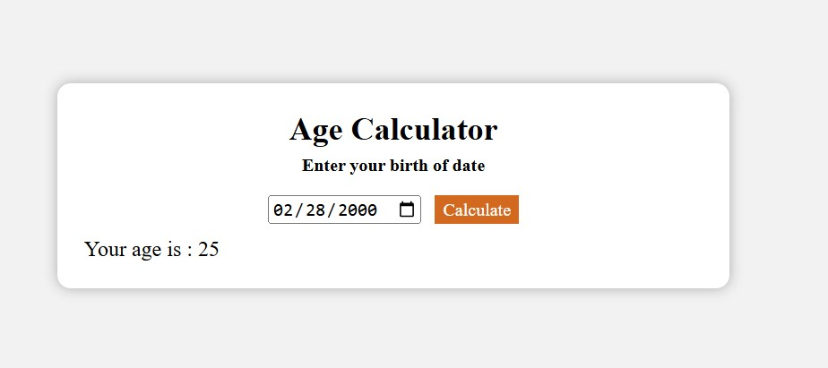

## 🎂 Age Calculator  

A simple and accurate **Age Calculator** built using HTML, CSS, and JavaScript. Quickly calculate your age based on your birthdate and find out how old you are in years.  

## 🚀 Features  
- ✅ Calculate your exact age in **years, months, and days**  
- ✅ Easy-to-use input for birthdate  
- ✅ Responsive and user-friendly design    

## 🛠 Tech Stack  
HTML, CSS, JavaScript  

## 📷 Screenshots  
  

## 📌 How to Use  
1. Enter your **birthdate** in the input field.  
2. Click the **Calculate** button.  
3. Instantly view your age in years, months, and days.  

## 📥 Download & Installation  
Clone the repository using Git:  
```bash
git clone https://github.com/aklema094/age-Calculator.git
```  
Or download the ZIP file manually from [here](https://github.com/aklema094/age-Calculator/archive/refs/heads/main.zip).  
